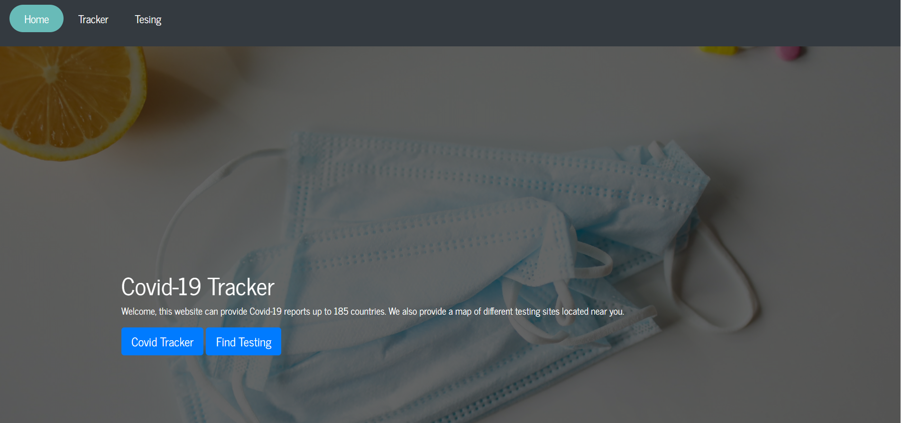
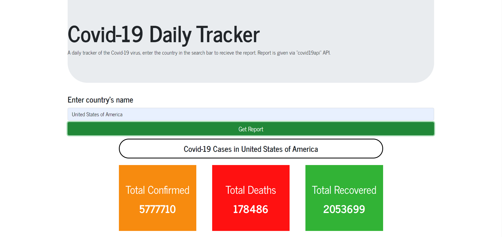
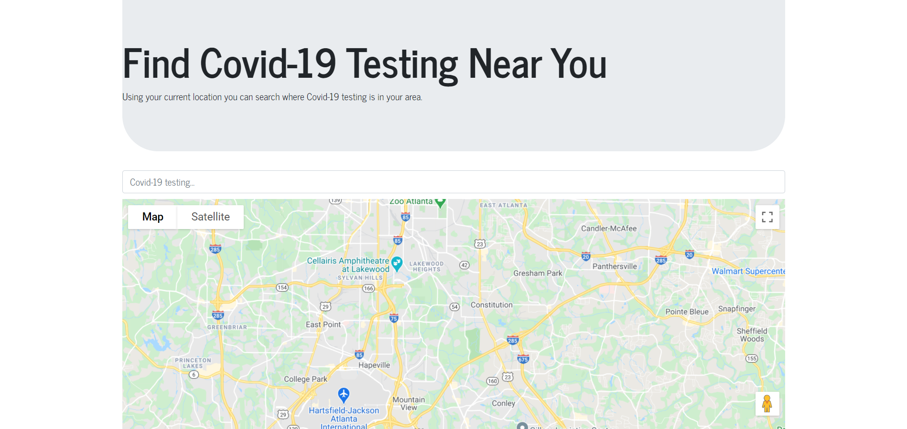

# Corona-tracker
<h2>Covid-19 World Tracking</h2>

This app is tracking the current cases of Covid-19/Corona Virus up to 185 countries. Also providing Covid-19 testing locations based on users GPS location.
 
<h3>Covid-19 Tracking</h3>

The tracker has access to https://api.covid19api.com/summary which has access to 185 different countries with the following categories of Total Confirmed, Total Deaths, Total Recovered, New Confirmed, New Deaths and New Recovered.
 
<h3>Covid-19 Testing</h3>

The map was created with the use of Google Maps API.